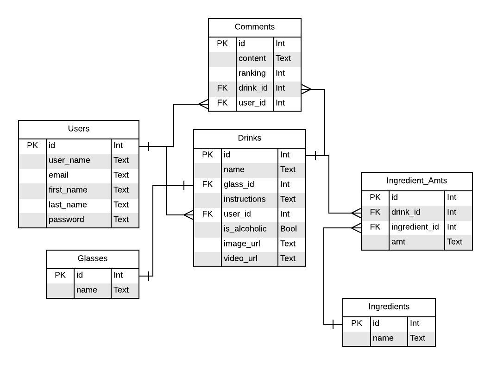

# Drinkr

by M. Cook

## Objective

The website will be a convenient resource for looking up mixed drink recipes.  Users will be able to look up cocktail recipes by name, ingredient, type of glass, or type of drink.  Users will also be able to mark drinks as favorites and leave comments, which would be helpful for annotating recipes.

## Audience

This site will be intended for people of legal drinking age who enjoy dabbling in mixology.

## Data Sources

API: [The Cocktail DB](https://www.thecocktaildb.com/api.php)
Database: PostgreSQL

The API will be used to retrieve information on the drinks, and the database will store information on the users, comments left on drinks, and any custom drinks they add.

## Approach

### Schema

### Sensitive Information

- Usernames and passwords
  - Passwords will be hashed using Bcrypt
  - A user's email address, first name, and last name will only be visible to the user

### Steps

#### Build Model

- [ ] User model
  - [x] Columns
    - [x] id
    - [x] username
    - [x] password
    - [x] email
    - [x] firstName
    - [x] lastName
  - [ ] Methods
    - [x] register
    - [x] authenticate
    - [x] hash password
    - [x] repr
    - [x] get
    - [x] getAll
- [x] Glass model
  - [x] Columns
    - [x] id
    - [x] name
  - [x] Methods
    - [x] get
    - [x] getAll
    - [x] repr
- [ ] Drink model
  - [x] Columns
    - [x] id (PK)
    - [x] name (text)
    - [x] glass_id (FK)
    - [x] user_id (FK)
    - [x] instructions (text)
    - [x] isAlcoholic (Boolean)
    - [x] imageUrl (text)
    - [x] videoUrl (text)
  - [ ] Methods
    - [ ] add
    - [ ] get
    - [ ] getByUser
    - [ ] getByName
    - [ ] edit
    - [ ] delete
- [ ] Drink_ingredient model
  - [x] Columns
    - [x] id (PK)
    - [x] drink_id (FK)
    - [x] ingredient_id (FK)
    - [x] amount (text)
  - [ ] Relationships
- [ ] Comments
  - [x] Columns
    - [x] id (PK)
    - [x] content (text)
    - [x] ranking (int)
    - [x] user_id (FK)
    - [x] drink_id (FK)
  - [ ] Methods
    - [ ] repr
    - [x] get
    - [x] getAll
    - [x] getByUser
    - [ ] getByDrink
    - [ ] add
    - [ ] edit
    - [ ] delete

Drinks
------
-user_id
-name
-video
-category
-IBA_category_id
-is_alcoholic
-glass_id
-instructions

Ingredient_Amt
--------------
-id
-drink_id
-ingredient_id
-amt_id

IBA_Categories
--------------
-id
-description

Glasses
-------
-id
-name

Drink
-----
Name
Video
Category
Is alcoholic
Glass
Instructions
Image_url
Ingredients
Ingredient amounts

id
drink_id
ingredient_id
amt