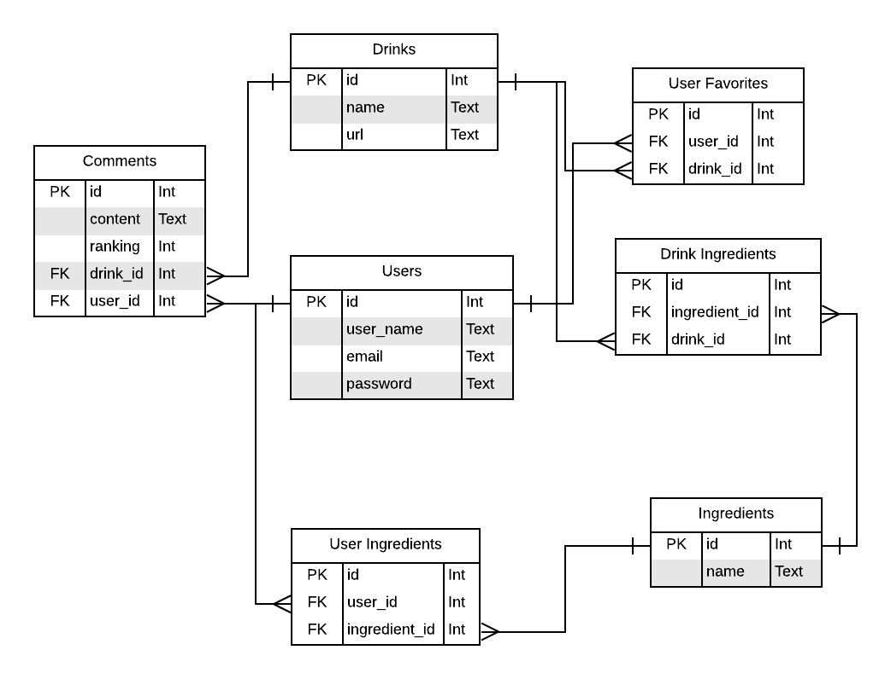

# Drinkr

by M. Cook

## Objective

The website will be a convenient resource for looking up mixed drink recipes.  Users will be able to look up cocktail recipes by name, ingredient, type of glass, or type of drink.  Users will also be able to mark drinks as favorites and leave comments, which would be helpful for annotating recipes.

## Audience

This site will be intended for people of legal drinking age who enjoy dabbling in mixology.

## Data Sources

API: [The Cocktail DB](https://www.thecocktaildb.com/api.php)
Database: PostgreSQL

The API will be used to retrieve information on the drinks, and the database will store information on the users, comments left on drinks, and any custom drinks they add.

## Approach

### Schema



### Sensitive Information

- Usernames and passwords
  - Passwords will be hashed using Bcrypt
  - A user's email address, first name, and last name will only be visible to the user

### Database backup

```bash
pg_dump -U matt drinkr > drinkr.pgsql
```

### To-Do

- [ ] Do landing page
  - [ ] Links to signing in, registering, or just going straight to drinks/ingredients
  - [ ] Add some flavor text
- [ ] Write tests
- [ ] Add new DB schema
- [ ] Add user flow

### Reflections and Takeaways

- Not every form/input needs to be secured against CSRF
- Taking some time to create a plan of action helps a lot
- Adding print statements when executing a program that takes a while is a good way to keep track of progress (and make sure it hasn't frozen)
